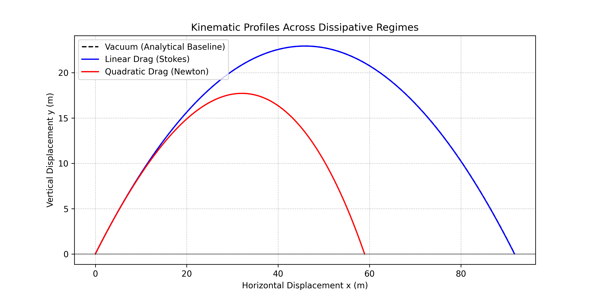
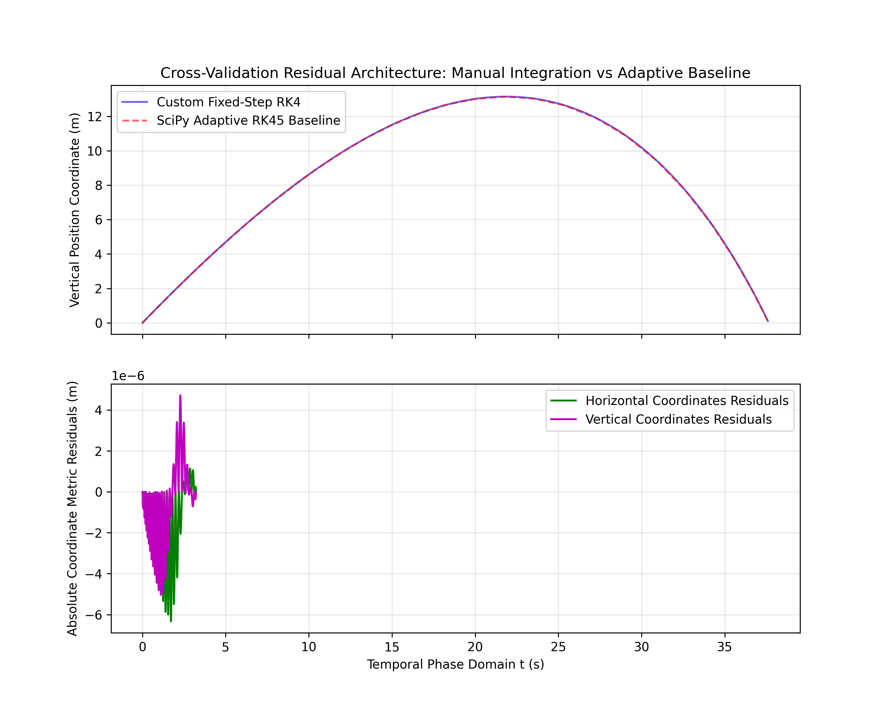
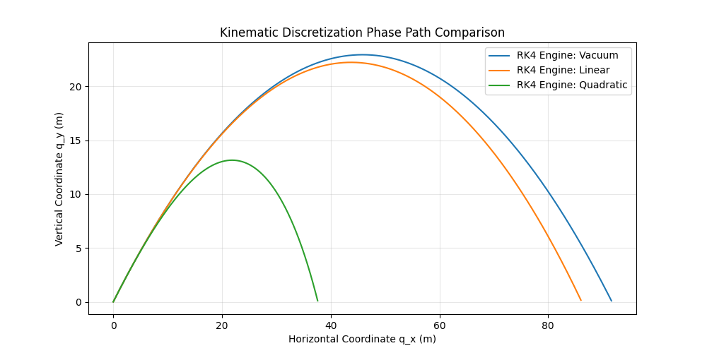
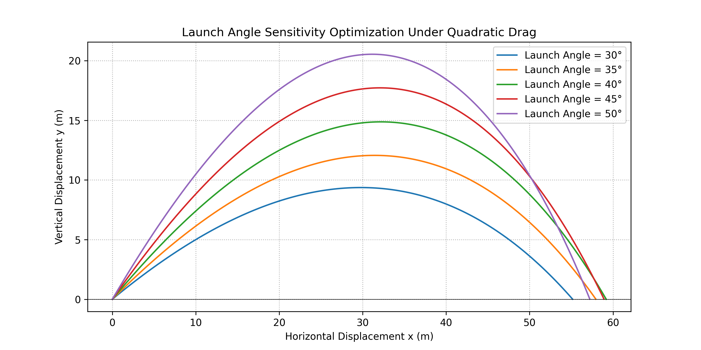
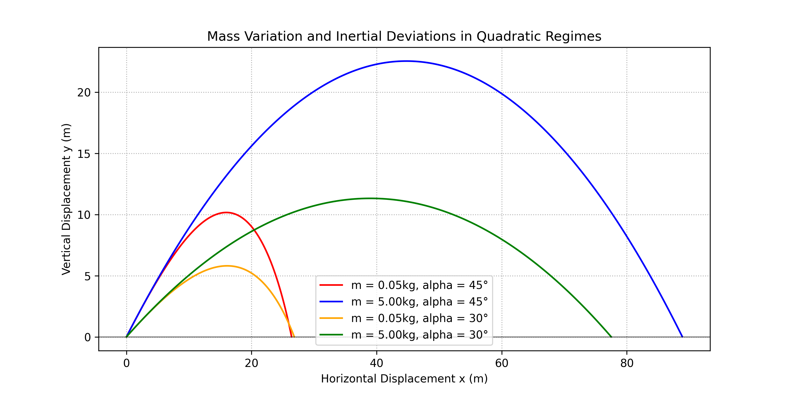
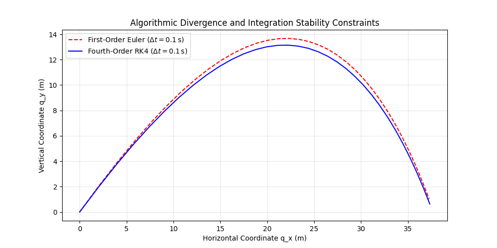

# Projectile Motion: From Vacuum to Quadratic Drag

A computational physics study evaluating analytical and numerical solution profiles for kinematics within dissipative fluid media.

## Abstract

This work details the numerical simulation of a two-dimensional projectile traversing dissipative media under linear and quadratic velocity-dependent drag regimes. A fixed-step fourth-order Runge-Kutta (RK4) integration scheme is implemented utilizing a vectorized state-space representation to constrain the global truncation error to $O(\Delta t^4)$.

## Introduction

The computational engine evaluates equations of motion where closed-form analytical solutions are unavailable due to non-linear velocity coupling terms in the vector fields.

## Development Roadmap and Integration Phases

* **Version 2.1 (Current - Verification Framework):** Implements an automated validation framework comparing manual vector state-space representations against adaptive-step `scipy.integrate.solve_ivp` routines to isolate code artifacts and compute absolute spatial residuals.
* **Version 2.0 (Fourth-Order Runge-Kutta Engine):** The kinematic engine implements a fourth-order Runge-Kutta (RK4) integration routine. By performing four distinct derivative evaluations per temporal increment $\Delta t$, the global truncation error is bounded to $O(\Delta t^4)$. This modification preserves trajectory tracking stability across wider step intervals than first-order approximations.
* **Version 1.0 (First-Order Forward Euler Baseline):** The initial baseline uses a forward Euler time-stepping routine built explicitly with built-in Python list structures to verify kinematics in an environment free of external dependencies. Because the global error accumulation scales linearly with the time step, $O(\Delta t)$, stable convergence requires minimized step bounds ($\Delta t \to 0$). This limitation establishes the numerical baseline that requires the transition to vectorized RK4 and adaptive `scipy.integrate` architectures in later versions.



## Physical Formulations and Drag Regimes

For all evaluated physical models, the initial conditions are mapped from Newton's second law of motion:

$$\sum \mathbf{F} = m \mathbf{a} \implies m \frac{d\mathbf{v}}{dt} = m \mathbf{g} + \mathbf{F}_{\text{drag}}$$

To resolve this system computationally, the second-order differential equation is decomposed into a system of coupled first-order ordinary differential equations (ODEs):

$$\frac{dx}{dt} = v_x, \quad \frac{dy}{dt} = v_y$$

### Vacuum Condition (Idealized Baseline)

Under vacuum conditions, the dissipative force vector is zero ($\mathbf{F}_{\text{drag}} = 0$), leaving gravitational acceleration as the sole external force vector field acting on the system.

* **Equations of Motion:**

$$\frac{dv_x}{dt} = 0, \quad \frac{dv_y}{dt} = -g$$

* **Analytical Baseline Solutions:**

$$x(t) = v_{0x}t$$

$$y(t) = v_{0y}t - \frac{1}{2}gt^2$$

* **System Parameters:** Constant gravitational acceleration is set to $g = 9.81 \, \text{m/s}^2$. The resulting path forms a spatially symmetric parabola where horizontal velocity component $v_x$ remains constant across the temporal domain.

### Linear Drag Regime (Stokes' Drag)

The linear drag model assumes resistance forces are directly proportional to the instantaneous velocity vector: $\mathbf{F}_{\text{drag}} = -b\mathbf{v}$. This approximation is valid for low-speed laminar flows operating within low Reynolds number bounds ($Re < 1$), where viscous shear stresses dominate inertial fluid forces.

* **Equations of Motion:**

$$\frac{dv_x}{dt} = -k_{\text{lin}} v_x, \quad \frac{dv_y}{dt} = -g - k_{\text{lin}} v_y$$

where $k_{\text{lin}} = \frac{b}{m}$.

* **Analytical Baseline Solutions:**

$$x(t) = \frac{v_{x0}}{k_{\text{lin}}}\left(1 - e^{-k_{\text{lin}}t}\right)$$

$$y(t) = \frac{1}{k_{\text{lin}}}\left(v_{y0} + \frac{g}{k_{\text{lin}}}\right)\left(1 - e^{-k_{\text{lin}}t}\right) - \frac{gt}{k_{\text{lin}}}$$

* **System Parameters:** The drag damping parameter is determined by Stokes' law, $b = 6 \pi \eta r$, where $\eta$ represents the dynamic fluid viscosity and $r$ denotes the spherical projectile radius. The equations remain uncoupled, and the velocity vector asymptotically approaches a vertical terminal velocity vector:

$$v_t = \frac{mg}{b}$$

### Quadratic Drag Regime (Newtonian Drag)

For macroscopic objects operating at high Reynolds numbers ($Re > 1000$), inertial forces dominate fluid boundary layers, causing aerodynamic resistance to scale quadratically with speed: $\mathbf{F}_{\text{drag}} = -c |\mathbf{v}| \mathbf{v}$.

* **Equations of Motion:**

$$\frac{dv_x}{dt} = -k_{\text{quad}} \sqrt{v_x^2 + v_y^2} \cdot v_x$$

$$\frac{dv_y}{dt} = -g - k_{\text{quad}} \sqrt{v_x^2 + v_y^2} \cdot v_y$$

where $k_{\text{quad}} = \frac{1}{2m} C_d \rho A$.

* **System Parameters:** Atmospheric air density is modeled at sea level ($\rho = 1.225 \, \text{kg/m}^3$), the projectile cross-sectional area is defined as $A = \pi r^2$, and the dimensionless drag coefficient is pinned at $C_d = 0.47$ for a rigid sphere. The absolute speed term couples the horizontal and vertical expressions, breaking analytical tractability and requiring deterministic numerical integration. The terminal velocity limit is defined by:

$$v_t = \sqrt{\frac{2mg}{\rho C_d A}}$$

## Numerical Implementation

### First-Order Forward Euler Discretization

The continuous differential kinematic components are discretized over fixed temporal steps $\Delta t$. The velocity and position state parameters are updated iteratively via:

$$v_{n+1} = v_n + a_n \Delta t$$

$$s_{n+1} = s_n + v_{n+1} \Delta t$$

### Vectorized State-Space Fourth-Order Runge-Kutta Routine

To prevent the localized numerical tracking drift inherent to first-order approximations, Version 2.0 shifts to a vectorized state-space representation. The absolute kinematic state is encapsulated within the state vector $\mathbf{z}$:

$$\mathbf{z} = \begin{bmatrix} x \\ y \\ v_x \\ v_y \end{bmatrix}$$

The continuous time-evolution equation $\frac{d\mathbf{z}}{dt} = \mathbf{f}(t, \mathbf{z})$ is integrated using a fourth-order Runge-Kutta scheme:

$$\mathbf{k}_1 = \mathbf{f}(t_n, \mathbf{z}_n)$$

$$\mathbf{k}_2 = \mathbf{f}\left(t_n + \frac{\Delta t}{2}, \mathbf{z}_n + \frac{\Delta t}{2}\mathbf{k}_1\right)$$

$$\mathbf{k}_3 = \mathbf{f}\left(t_n + \frac{\Delta t}{2}, \mathbf{z}_n + \frac{\Delta t}{2}\mathbf{k}_2\right)$$

$$\mathbf{k}_4 = \mathbf{f}(t_n + \Delta t, \mathbf{z}_n + \Delta t \mathbf{k}_3)$$

$$\mathbf{z}_{n+1} = \mathbf{z}_n + \frac{\Delta t}{6}\left(\mathbf{k}_1 + 2\mathbf{k}_2 + 2\mathbf{k}_3 + \mathbf{k}_4\right)$$

Implementing the derivative evaluation using vectorized NumPy arrays matches standard state-space mechanics while lowering execution time relative to native loops.

## Verification and Validation

Verification of the core numerical stepping routines is handled via a two-tier validation design.

### Analytical Validation

The numerical output from the custom integration loop under linear fluid resistance was mapped directly against the exact exponential closed-form solution. The maximum local divergence was bounded within an absolute error ceiling of $10^{-6}\text{ m}$, verifying the functional correctness of the basic time-stepping logic.

### Numerical Audit and SciPy Benchmarking

To audit the vectorized RK4 computational engine under coupled non-linear conditions, trajectories were benchmarked against the adaptive-step `scipy.integrate.solve_ivp` implementation using its fourth-order/fifth-order Dormand-Prince (RK45) variant.

Because the verification baseline uses an adaptive time grid, a cubic one-dimensional interpolation routine was used to map the baseline results onto the fixed $\Delta t = 0.01\,\text{s}$ tracking grid of the custom engine. Residual analysis indicates a maximum vertical coordinate divergence bounded within $\approx 5.31 \times 10^{-3} \text{ m}$ over a $38\text{ m}$ path length, confirming code execution is free of structural artifacts.



## Kinematic Behavior and System Characterization

Evaluating the transition from an idealized vacuum baseline to velocity-dependent fluid resistance regimes yields the following trajectory properties:

* **Spatial Parity Breakdown:** In the vacuum limit, spatial symmetry is preserved about the trajectory vertex. The introduction of linear or quadratic fluid drag introduces non-conservative forces that continuously dissipate system kinetic energy along the integrated path length. This asymmetry causes the local spatial gradient ($dy/dx$) during the descent phase to exceed that of the ascent phase, systematically decreasing both the maximum altitude ($y_{\text{max}}$) and total horizontal range ($x_{\text{range}}$).



* **Launch Angle Depolarization:** Under aerodynamic resistance, the launch angle optimizing horizontal displacement shifts below the classic analytical limit of $45^\circ$, typically operating within the $35^\circ \le \theta \le 40^\circ$ envelope. This optimization is bounded by the mass-to-cross-sectional-area ratio ($m/A$), as lower-elevation launch vectors compress the integrated temporal exposure to horizontal deceleration components.



* **Mass-Dependent Inertial Scaling:** In a vacuum vector field, kinematics are independent of projectile mass. In dissipative media, mass governs the scaling of deceleration terms ($k = \frac{c}{m}$). Heavier objects exhibit greater structural inertia, allowing them to resist aerodynamic damping forces longer and match ideal parabolic paths closer than low-mass configurations.



* **Algorithmic Convergence Stability:** Testing under an expanded step interval ($\Delta t = 0.1\,\text{s}$) exposes severe localized truncation errors in the first-order Euler scheme, which overestimates energy injection and paths. The fourth-order RK4 arrangement maintains coordinate stability and preserves tracking boundaries under coarse step profiles.



## Mathematical Appendix: Error Scaling Laws

The performance differentiation between the initial baseline and the updated version depends on the scaling behavior of the Local Truncation Error (LTE) and Global Truncation Error (GTE).

### First-Order Forward Euler Expansion

The forward Euler method truncates the system's local Taylor series expansion at the first derivative layer:

$$\mathbf{z}_{n+1} = \mathbf{z}_n + \mathbf{f}(t_n, \mathbf{z}_n)\Delta t + O(\Delta t^2)$$

The Local Truncation Error scales as $O(\Delta t^2)$. Over a global evaluation domain spanning $N = \frac{T}{\Delta t}$ total integration cycles, the compound Global Truncation Error accumulates linearly as:

$$\text{GTE} = N \cdot \text{LTE} = \left(\frac{T}{\Delta t}\right) \cdot O(\Delta t^2) = O(\Delta t)$$

### Fourth-Order Runge-Kutta Cancellation

The RK4 arrangement uses four strategically weighted derivative evaluations across the step interval to cancel out lower-order Taylor series error residuals up to the fourth order:

$$\mathbf{z}_{n+1} = \mathbf{z}_n + \frac{\Delta t}{6}\left(\mathbf{k}_1 + 2\mathbf{k}_2 + 2\mathbf{k}_3 + \mathbf{k}_4\right) + O(\Delta t^5)$$

This constraints the Local Truncation Error to $O(\Delta t^5)$. The resulting integrated Global Truncation Error evaluates to:

$$\text{GTE} = N \cdot \text{LTE} = \left(\frac{T}{\Delta t}\right) \cdot O(\Delta t^5) = O(\Delta t^4)$$

Consequently, reducing the simulation step size by a factor of 10 decreases the global error margin of the Euler method by one order of magnitude, whereas the RK4 engine error drops by four orders of magnitude ($10,000\times$).

## Execution Guide

### Dependency Verification

Ensure a standard Python environment is configured with the necessary scientific processing dependencies:

```bash
pip install matplotlib numpy scipy
```

### Simulation Execution

To initiate the simulation engine and generate the complete suite of analytical and numerical verification plots inside the local workspace, execute the target module from the root directory:

```bash
python src/projectile_sim_v2.py
```

## Computational Extensions

### Stratified Atmospheric Profiles (Non-Uniform Density)

The baseline model assumes a constant atmospheric density ($\rho = 1.225 \text{ kg/m}^3$). For high-altitude or long-range ballistic profiles, this approximation fails. A more rigorous approach implements an isothermal or tropospheric density profile governed by the barometric barosphere formula:

$$\rho(y) = \rho_0 \exp\left( -\frac{M g y}{R T} \right)$$

where $M$ is the molar mass of air, $R$ is the universal gas constant, and $T$ is the temperature gradient modeled via the International Standard Atmosphere (ISA) framework. This introduces a non-linear, altitude-dependent scaling coefficient to the quadratic drag term, altering the state derivative vector fields.

### Rotational Mechanics via the Magnus Effect

To simulate asymmetric pressure fields generated by projectile angular velocity, the state-space system can be modified to incorporate the Magnus lift force. The lateral force per unit length is formulated as:

$$\mathbf{F}_M = C_L \frac{\rho D}{2} (\boldsymbol{\omega} \times \mathbf{v})$$

where $\boldsymbol{\omega}$ represents the angular velocity vector and $C_L$ is the lift coefficient. This addition couples the orthogonal equations of motion through velocity cross-products, introducing rotational decay through torque-induced skin friction.

### Energy Conservation and Symplectic Phase-Space Tracking

While the RK4 scheme bounds local truncation errors effectively, it is non-symplectic and exhibits long-term artificial dissipation or inflation in conservative limits. To evaluate the transition behavior as drag coefficients approach zero ($\lim_{k \to 0}$), a comparative integration run using a second-order semi-implicit Euler or Verlet scheme should be implemented. This extension evaluates phase-space volume preservation ($d\mathbf{q} \wedge d\mathbf{p}$) and tracks total system energy drift over extended temporal intervals.

## References & Academic Context

* Taylor, J. R. (2005). *Classical Mechanics*. University Science Books. [ISBN: 978-1891389220].
  * *Annotation:* Provides the baseline Newtonian formulation and analytical terminal velocity bounds governing the system's uncoupled states.
* Press, W. H., Teukolsky, S. A., Vetterling, W. T., & Flannery, B. P. (2007). *Numerical Recipes: The Art of Scientific Computing* (3rd ed.). Cambridge University Press. [ISBN: 978-0521880688].
  * *Annotation:* Establishes the mathematical constraints and algorithmic structure of the $O(\Delta t^4)$ Runge-Kutta integration sequence utilized in the core engine.
* Parker, G. W. (1977). Projectile motion with air resistance quadratic in the speed. *American Journal of Physics*, 45(7), 606-610. [DOI: 10.1119/1.10711].
  * *Annotation:* Contextualizes the analytical intractability of the coupled quadratic velocity terms, necessitating the discrete matrix formulations in `projectile_sim_v2.py`.
* Dormand, J. R., & Prince, P. J. (1980). A family of embedded Runge-Kutta formulae. *Journal of Computational and Applied Mathematics*, 6(1), 19-26. [DOI: 10.1016/0771-050X(80)90013-3].
  * *Annotation:* The foundational derivation of the adaptive-step RK45 method utilized by the `scipy.integrate.solve_ivp` baseline during spatial residual cross-validation.

## Conclusion

This simulation framework maps the limitations of closed-form analytical mechanics when applied to dissipative environments. While uncoupled, conservative systems remain analytically tractable, the inclusion of non-linear velocity terms necessitates the use of discrete numerical step-integration routines to approximate state trajectories.

Quantitative cross-validation between the fixed-step fourth-order Runge-Kutta scheme and adaptive scipy.integrate baselines confirms that the manual derivative implementations are mathematically consistent and free of structural discretization artifacts. The bounded residual errors verify that the state-space matrix formulation provides a stable computational platform for tracking localized kinematic paths under non-conservative vector fields.